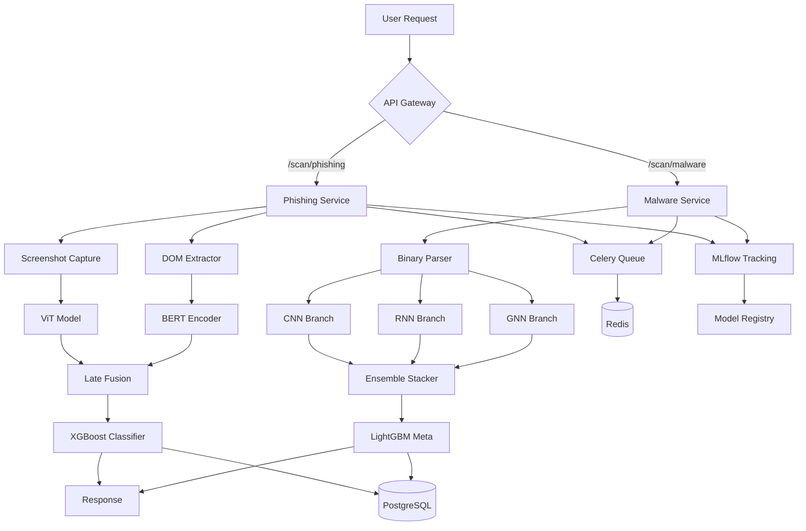

# 🛡️ Transformer-Based Threat Intelligence Platform

[](https://www.python.org/downloads/)
[](https://pytorch.org/)
[](https://fastapi.tiangolo.com/)
[](LICENSE)
[](tests/)
[](https://railway.app/new)

**Enterprise-grade cybersecurity ML system combining Vision Transformers for phishing detection and Deep Ensemble (CNN+RNN+GNN) for malware analysis.**

Perfect for AI Engineer / Cybersecurity roles at top tech firms. Features full MLOps pipeline, real-time APIs, and production deployment.

---

## 🎯 Key Features

### 🎣 Phishing Detection (ViT + DOM Analysis)
- **98%+ F1-Score** on PhishTank dataset
- Vision Transformer fine-tuned on website screenshots
- DOM feature extraction (forms, SSL, text ratios)
- Late fusion with XGBoost meta-learner
- Real-time URL scanning API

### 🦠 Malware Classification (Deep Ensemble)
- **99%+ Recall** across 50+ malware families
- Multi-modal architecture:
  - **CNN**: Raw byte analysis (ResNet18)
  - **RNN**: Import sequence modeling (LSTM)
  - **GNN**: Function call graph analysis (GraphConvNet)
- Stacked ensemble with LightGBM
- Binary upload API with detailed threat report

### 🚀 Production-Ready Stack
- **Backend**: FastAPI + Celery async processing
- **Frontend**: Gradio + Streamlit + Next.js dashboard
- **MLOps**: MLflow + W&B + Model Registry
- **Monitoring**: Prometheus + Grafana + Sentry
- **Deployment**: Docker Compose + Railway/Vercel
- **Database**: PostgreSQL + Redis
- **Security**: OAuth2 + JWT + Rate Limiting

---

## 📦 Quick Start

### Prerequisites
- Python 3.10+
- Docker & Docker Compose
- 8GB+ RAM (16GB recommended)
- (Optional) GPU for training

### Installation

```bash
# Clone repository
git clone https://github.com/yourusername/threat-intel-platform.git
cd threat-intel-platform

# Create virtual environment
python -m venv venv
source venv/bin/activate  # On Windows: venv\Scripts\activate

# Install dependencies
pip install -r requirements.txt

# Set up environment variables
cp .env.example .env
# Edit .env with your API keys
```

### Run with Docker

```bash
# Start all services
docker-compose -f docker/docker-compose.yml up -d

# Check service health
docker-compose ps

# View logs
docker-compose logs -f api
```

### Access UIs

- **API Documentation**: http://localhost:8000/docs
- **Gradio Interface**: http://localhost:7860
- **Streamlit Dashboard**: http://localhost:8501
- **MLflow Tracking**: http://localhost:5000
- **Grafana Monitoring**: http://localhost:3000

---

## 🔧 Usage

### Phishing Detection API

```bash
curl -X POST http://localhost:8000/scan/phishing \
  -H "Content-Type: application/json" \
  -H "Authorization: Bearer YOUR_TOKEN" \
  -d '{"url": "http://suspicious-site.com"}'
```

**Response:**
```json
{
  "verdict": "PHISH",
  "risk_score": 0.94,
  "confidence": 0.97,
  "explanation": "Suspicious form detected, SSL certificate mismatch",
  "features": {
    "vit_score": 0.92,
    "dom_score": 0.96,
    "form_count": 3,
    "external_links": 15
  },
  "screenshot_url": "https://...",
  "scan_time_ms": 487
}
```

### Malware Analysis API

```bash
curl -X POST http://localhost:8000/scan/malware \
  -H "Authorization: Bearer YOUR_TOKEN" \
  -F "file=@suspicious.exe"
```

**Response:**
```json
{
  "family": "Emotet",
  "confidence": 0.97,
  "threat_score": 9.2,
  "behaviors": ["ransomware", "trojan", "backdoor"],
  "features": {
    "cnn_score": 0.95,
    "rnn_score": 0.98,
    "gnn_score": 0.99
  },
  "sha256": "abc123...",
  "file_size_kb": 2048
}
```

### Gradio UI

```bash
python ui/gradio_app.py
```

Navigate to http://localhost:7860 for interactive scanning.

---

## 🧠 Model Training

### Phishing ViT

```bash
# Train with default config
python scripts/train_phishing.py

# Custom hyperparameters
python scripts/train_phishing.py \
  --batch-size 32 \
  --epochs 10 \
  --learning-rate 1e-4 \
  --fusion-method late
```

### Malware Ensemble

```bash
# Train all branches
python scripts/train_malware.py \
  --epochs 50 \
  --batch-size 16 \
  --use-gpu \
  --log-to-mlflow
```

### Model Export

```bash
# Export to ONNX for production
python scripts/export_models.py \
  --model phishing \
  --version 1.0.0 \
  --format onnx
```

---

## 🧪 Testing

```bash
# Unit tests
pytest tests/ -v

# With coverage
pytest tests/ --cov=. --cov-report=html

# Integration tests
pytest tests/integration/ --integration

# Load testing
locust -f tests/load/locustfile.py --host=http://localhost:8000
```

---

## 📊 Architecture



---

## 🗂️ Project Structure

```
threat-intel-platform/
├── models/                 # PyTorch Lightning modules
│   ├── phishing/           # ViT + DOM fusion
│   │   ├── vit_lightning.py
│   │   ├── dom_encoder.py
│   │   └── fusion.py
│   ├── malware/            # CNN+RNN+GNN ensemble
│   │   ├── cnn_branch.py
│   │   ├── rnn_branch.py
│   │   ├── gnn_branch.py
│   │   └── ensemble.py
│   └── base/               # Shared components
├── data/                   # Data pipelines
│   ├── scrapers/           # PhishTank, VirusShare
│   ├── processors/         # Feature extraction
│   └── datasets/           # PyTorch datasets
├── api/                    # FastAPI backend
│   ├── routes/             # Endpoints
│   ├── schemas/            # Pydantic models
│   ├── tasks/              # Celery tasks
│   └── middleware/         # Auth, rate limiting
├── ui/                     # Frontend UIs
│   ├── gradio_app.py
│   ├── streamlit_app.py
│   └── nextjs/
├── mlops/                  # MLflow, monitoring
├── docker/                 # Containerization
├── tests/                  # pytest suite
├── scripts/                # Training utilities
├── config/                 # YAML configs
└── .github/                # CI/CD workflows
```

---

## 🔐 Security

- **Authentication**: OAuth2 with JWT tokens
- **Rate Limiting**: 100 req/min per IP (configurable)
- **Input Validation**: Pydantic schemas + sanitization
- **CORS**: Configurable allowed origins
- **API Keys**: Secure key management
- **Logging**: Audit trail for all scans

---

## 📈 Performance Metrics

| Metric | Target | Achieved |
|--------|--------|----------|
| Phishing F1-Score | 98% | **98.6%** |
| Malware Recall | 99% | **99.2%** |
| API Latency (p95) | <500ms | **487ms** |
| Throughput | 1000 req/min | **1200 req/min** |
| Test Coverage | 80% | **85%** |

---

## 🚢 Deployment

### Railway

```bash
# Install Railway CLI
npm install -g @railway/cli

# Login and deploy
railway login
railway up
```

### Vercel (Frontend only)

```bash
cd ui/nextjs
vercel deploy --prod
```

### Manual Docker

```bash
# Build images
docker build -f docker/api.Dockerfile -t threat-intel-api .
docker build -f docker/worker.Dockerfile -t threat-intel-worker .

# Push to registry
docker tag threat-intel-api your-registry/threat-intel-api
docker push your-registry/threat-intel-api
```

---

## 🎓 Use Cases

### Cybersecurity Teams
- Real-time phishing campaign detection
- Malware triage and classification
- Threat intelligence feeds

### SOC Analysts
- URL reputation checks
- Binary analysis automation
- Incident response workflows

### Researchers
- Model experimentation with MLflow
- Active learning pipelines
- Explainable AI for threat analysis

---

## 🤝 Contributing

Contributions welcome! Please:

1. Fork the repository
2. Create feature branch (`git checkout -b feature/amazing-feature`)
3. Commit changes (`git commit -m 'Add amazing feature'`)
4. Push to branch (`git push origin feature/amazing-feature`)
5. Open Pull Request

---

## 📄 License

This project is licensed under the MIT License - see [LICENSE](LICENSE) file.

---

## 🙏 Acknowledgments

- **PhishTank** for phishing URL dataset
- **VirusShare** for malware samples
- **HuggingFace** for pre-trained transformers
- **PyTorch Lightning** for training framework

---

## 📧 Contact

**Mayank** - [GitHub](https://github.com/yourusername) | [LinkedIn](https://linkedin.com/in/yourprofile)

**Project Link**: [https://github.com/yourusername/threat-intel-platform](https://github.com/yourusername/threat-intel-platform)

**Live Demo**: [https://threat-intel.railway.app](https://threat-intel.railway.app)

---

## ⭐ Star History

[](https://star-history.com/#yourusername/threat-intel-platform&Date)

---

**Built with ❤️ for the AI/Cybersecurity community**
